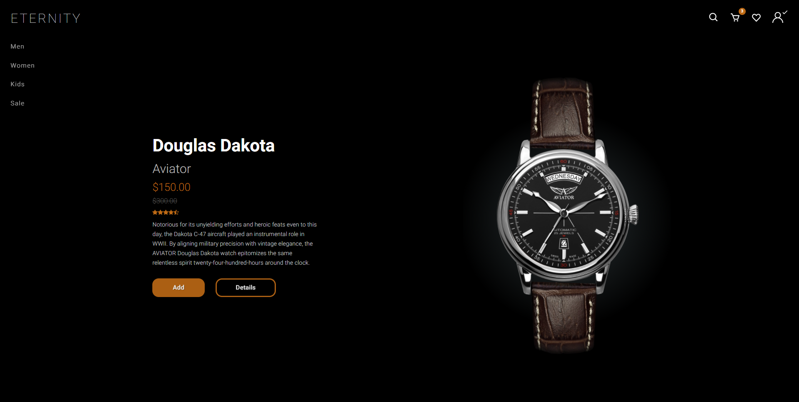
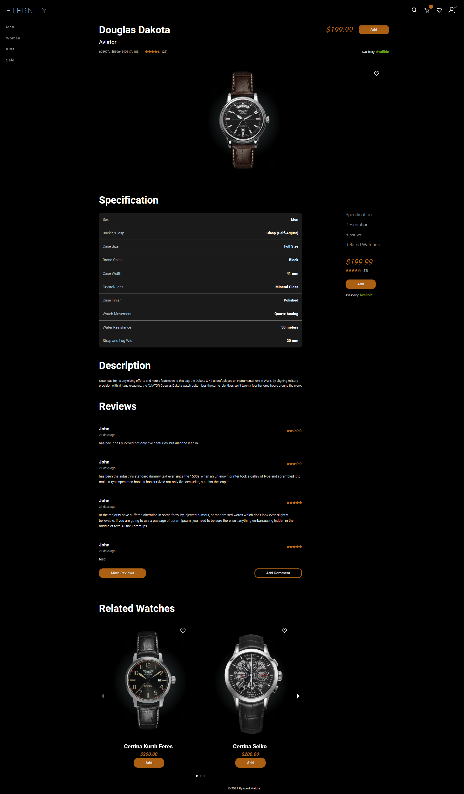
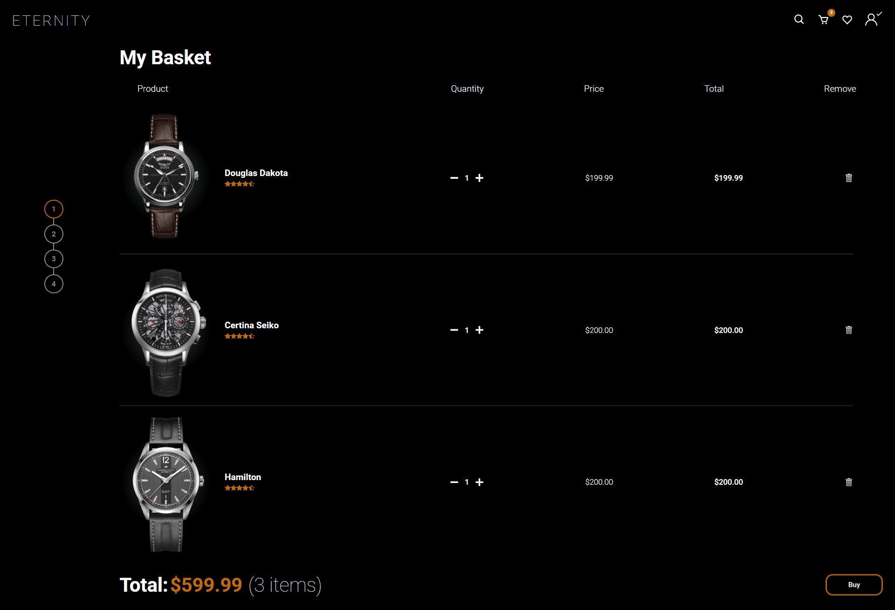
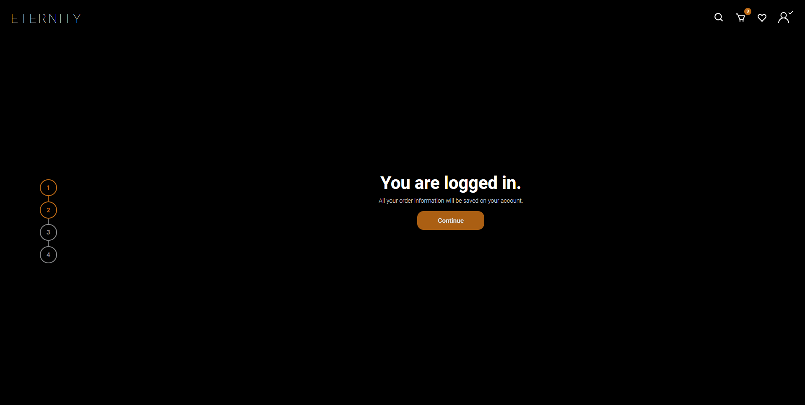
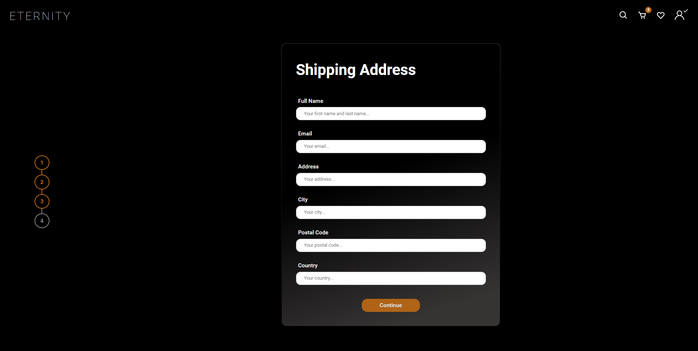
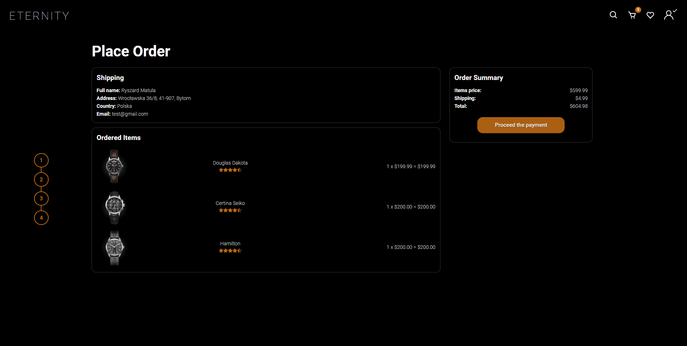
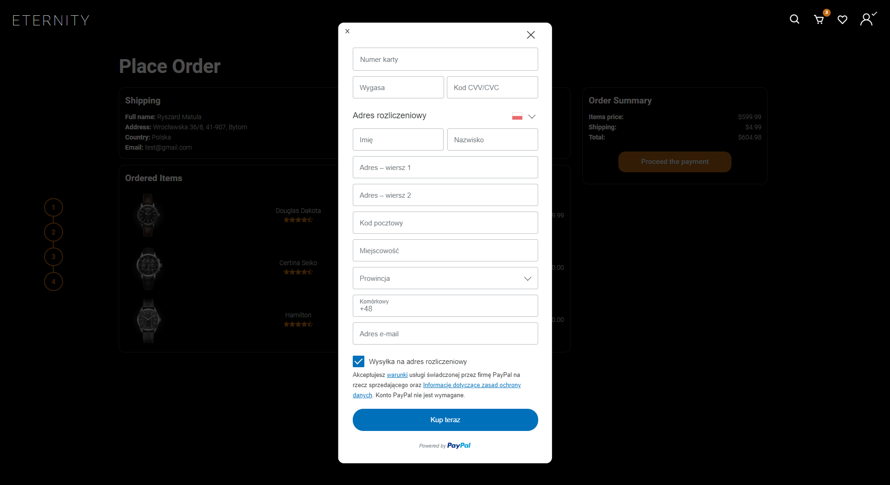
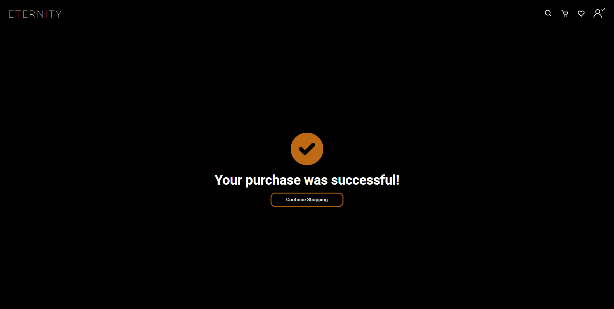
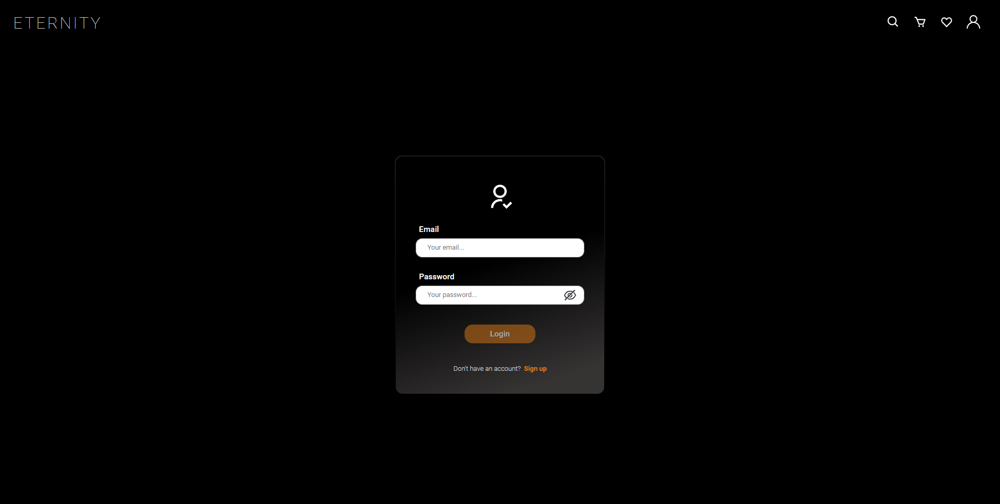
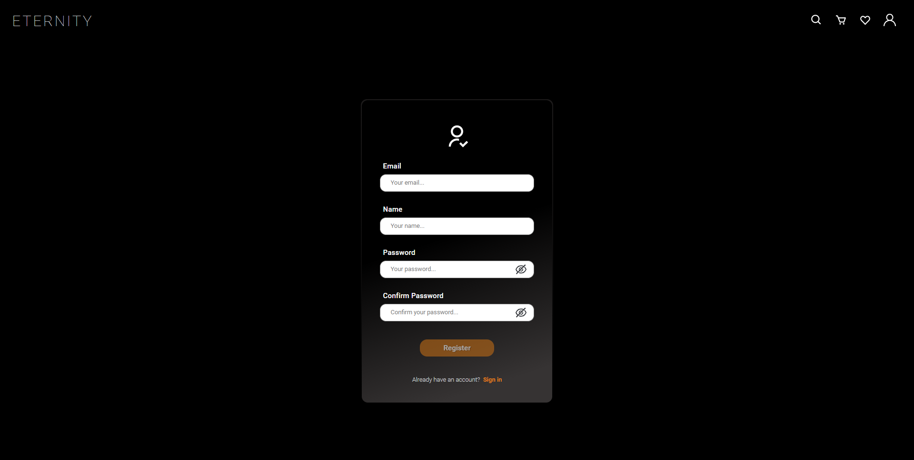

# ProgressPal

# Disclaimer

App is not ready yet

## Description

- [Technology Stack](#Frontend)
- [Screenshots](#Screenshots)

## Frontend

- Next.js
- Typescript
- Redux
- Axios
- Formik
- Yup
- Next/Image
- Swiper
- Moment
- React Paypal Button v2
- Styled Components

## Backend

- Typescript
- Node
- Express
- MongoDB
- Mongoose
- Multer
- JSON Web Token

# Every Page is Fully Responsive

## Screenshots

### Main page

### Specific product page:

### Cart / Basket:

### Cart / Login:

### Cart / Shipping address:

### Cart / Place order:

### Choosing payment process:

### Paying with debit card:

### Successful payment:

### Login screen:

### Register screen:

